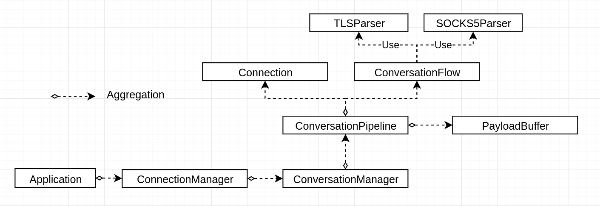

# Components

### Application
Actually runs the `ConnectionManager` using `Run()`

### ConnectionManager
Creates connections and listens for them using `epoll`.
After new connection occurs, it's being handled.
After that `ConversationPipeline` is being created from `ClientConnection`
in case if connection to the server after SOCSK5 Connetion Request was successful.

### ConversationManager
Operates `ConversationPipeline`:
- create new pipeline
- find existing pipeline

### ConversationFlow
Is used to switch differrent states. For instance: Receiving _SOCSK5 ClientHello_ and _TLS CLientHello_. Receiveing _SOCKS5 ConnectionRequest_
- __SOCKS5 flow__
    - __ClientHelloTransmition__

      Sends socks5 client hello message to proxy and receives reply from it(proxy).
    - __ConnectionRequestTransmition__

      Client sends socks5 connection request message to proxy, proxy tries to connect to the server and sends reply to client.
- __TLS flow__
    - __ReceievingClientHello__

      Proxy waits for valid ClientHello from client and sends it to server.
    - __ReceivingServerHello__

      Proxy waits for valid ServerHello from server and sends it to client.
### ConversationPipeline
Holds 2 endpoints and current flow which should be executed on the next epoll event.

Holds `ClientConnection`, `ServerConnection`, `ConversationFlow`, `PayloadBuffer`

`ClientConnection`/`ServerConnection` - are wrappers of client/server sockfds

`ConversationFlow` - TLS or SOCKS5 flow

`PayloadBuffer` - used for holding incomplete data (for example part of the TLS record).

### Connection
`Connection` holds buffer for receiving data from socket, socket file desctiptor,
pointer to `ConversationPipeline` for retrieving `PayloadBuffer` when it's necessary.

`ClientConnection`/`ServerConnection` -  2 derived classes. They're the same as Connection, created only for semantics purposes only. Will be removed soon.

### ByteStream
Simple wrapper of vector. Holds actually used number of bytes.

### SOCSK5/TLS Parsers
Are used to parse SOCSK5/TLS data.

Simple UML-diagram below:
